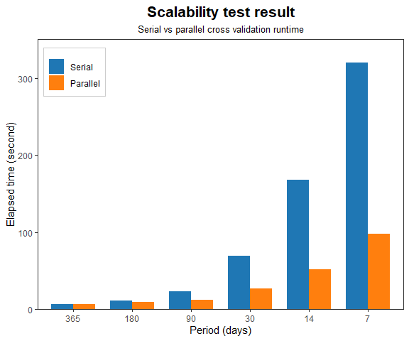

prophetuneR: Parallelized Cross-validation and Hyperparameter Tuning for
prophet
================
Author: Arif Setyawan

- [Description](#description)
- [Installation](#installation)
- [Parallel cross validation
  `par_cross_validation()`](#parallel-cross-validation-par_cross_validation)
- [Hyperparameter tuning
  `tune_prophet()`](#hyperparameter-tuning-tune_prophet)
- [Benchmarking](#benchmarking)
  - [Performance](#performance)
  - [Scalability](#scalability)

# Description

> This package provides convenience method to perform cross-validation
> in parallel, also hyperparameter tuning via grid search using
> parallelized cross-validation.

Since there is no built-in function to do hyperparameter tuning in
`prophet` (when this package was created), the function `tune_prophet()`
will come in handy. Also, parallel processing using
`par_cross_validation()` is applied to speed up the tuning works. This
package depends on the original `prophet`, so make sure you install it
before using this package.

# Installation

You need to install `devtools` and `prophet` package prior to install
`prophetuneR`. If you haven’t, run the code below

``` r
install.packages('devtools')
install.packages('prophet')
```

Then you can run this code

``` r
devtools::install_github('rifset/prophetuneR)
```

Loading the package

``` r
library(prophet)
library(prophetuneR)
```

# Parallel cross validation `par_cross_validation()`

Parallelized version of `cross_validation()` from prophet forecasting
tool

**Usage**

``` r
par_cross_validation(
  model,
  horizon,
  units,
  period = NULL,
  initial = NULL,
  cutoffs = NULL,
  n.jobs = -1L
)
```

**Arguments**

- `model`: Fitted Prophet model.
- `horizon`: Integer size of the horizon.
- `units`: String unit of the horizon, e.g., “days”, “secs”.
- `period`: Integer amount of time between cutoff dates. Same units as
  horizon. If not provided, 0.5 \* horizon is used.
- `initial`: Integer size of the first training period. If not provided,
  3 \* horizon is used. Same units as horizon.
- `cutoffs`: Vector of cutoff dates to be used during cross-validation.
  If not provided works beginning from (end - horizon), works backwards
  making cutoffs with a spacing of period until initial is reached.
- `n.jobs`: **(New)** Number of cores to run in parallel, if `-1` all
  available cores are used (default is `-1`)

**Output**

A dataframe with the forecast, actual value, and cutoff date.

**Example**

``` r
df <- read.csv('https://raw.githubusercontent.com/facebook/prophet/main/examples/example_wp_log_peyton_manning.csv')
m <- prophet(df)
cv <- par_cross_validation(
  model = m,
  horizon = 365,
  units = 'days',
  n.jobs = 4
)
print(head(cv))
```

|      y | ds         |   yhat | yhat_lower | yhat_upper | cutoff     |
|-------:|:-----------|-------:|-----------:|-----------:|:-----------|
| 8.4092 | 2011-01-22 | 9.1468 |     8.5940 |     9.6660 | 2011-01-21 |
| 8.9731 | 2011-01-23 | 9.5353 |     9.0161 |    10.0888 | 2011-01-21 |
| 9.5503 | 2011-01-24 | 9.8276 |     9.3399 |    10.3604 | 2011-01-21 |
| 8.7863 | 2011-01-25 | 9.6632 |     9.1623 |    10.1803 | 2011-01-21 |
| 8.6081 | 2011-01-26 | 9.4929 |     8.9542 |    10.0157 | 2011-01-21 |
| 8.4949 | 2011-01-27 | 9.4760 |     8.9166 |     9.9810 | 2011-01-21 |

# Hyperparameter tuning `tune_prophet()`

Hyperparameter tuning for prophet model via grid search algorithm using
parallelized cross-validation to shorten tuning time.

**Usage**

``` r
tune_prophet(df, horizon, units, args.list, ...)
```

**Arguments**

- `df`: Dataframe containing the history. Must have columns ds (date
  type) and y, the time series. If growth is logistic, then df must also
  have a column cap that specifies the capacity at each ds. If not
  provided, then the model object will be instantiated but not fit; use
  fit.prophet(m, df) to fit the model.
- `horizon`: Integer size of the horizon.
- `units`: String unit of the horizon, e.g., “days”, “secs”.
- `args.list`: List of parameters values to be evaluated. Based on
  prophet official documentation, parameters that can be tuned
  including: `changepoint.prior.scale`, `seasonality.prior.scale`,
  `holidays.prior.scale`, `seasonality.mode`, and `changepoint.range`.
- `...`: Additional arguments, passed to `par_cross_validation()`.

**Output**

A dataframe with the parameters and their performance metrics.

**Example**

``` r
df <- read.csv('https://raw.githubusercontent.com/facebook/prophet/main/examples/example_wp_log_peyton_manning.csv')
tuning_result <- tune_prophet(
  df = df,
  horizon = 365,
  units = 'days',
  args.list = list(
    changepoint.prior.scale = c(0.001, 0.01, 0.1, 0.5),
    seasonality.prior.scale = c(0.01, 0.1, 1.0, 10.0)
  )
)
print(tuning_result)
```

**Tuning result**

| changepoint.prior.scale | seasonality.prior.scale |    mse |   rmse |    mae |   mape |  mdape |  smape | coverage |
|------------------------:|------------------------:|-------:|-------:|-------:|-------:|-------:|-------:|---------:|
|                   0.001 |                    0.01 | 0.5442 | 0.7377 | 0.6015 | 0.0737 | 0.0678 | 0.0716 |   0.5906 |
|                   0.010 |                    0.01 | 0.4664 | 0.6829 | 0.5018 | 0.0596 | 0.0472 | 0.0592 |   0.7076 |
|                   0.100 |                    0.01 | 0.6428 | 0.8017 | 0.6204 | 0.0740 | 0.0639 | 0.0733 |   0.6687 |
|                   0.500 |                    0.01 | 0.9141 | 0.9561 | 0.7043 | 0.0832 | 0.0643 | 0.0825 |   0.8105 |
|                   0.001 |                    0.10 | 0.5267 | 0.7258 | 0.5883 | 0.0719 | 0.0667 | 0.0700 |   0.6164 |
|                   0.010 |                    0.10 | 0.4677 | 0.6839 | 0.5023 | 0.0597 | 0.0471 | 0.0593 |   0.7073 |
|                   0.100 |                    0.10 | 0.5692 | 0.7544 | 0.5770 | 0.0688 | 0.0595 | 0.0682 |   0.6990 |
|                   0.500 |                    0.10 | 0.4815 | 0.6939 | 0.5059 | 0.0593 | 0.0485 | 0.0600 |   0.8968 |
|                   0.001 |                    1.00 | 0.5323 | 0.7296 | 0.5920 | 0.0724 | 0.0667 | 0.0704 |   0.6093 |
|                   0.010 |                    1.00 | 0.4632 | 0.6806 | 0.4994 | 0.0593 | 0.0468 | 0.0589 |   0.7097 |
|                   0.100 |                    1.00 | 0.5661 | 0.7524 | 0.5743 | 0.0684 | 0.0591 | 0.0679 |   0.7021 |
|                   0.500 |                    1.00 | 0.4811 | 0.6936 | 0.5045 | 0.0592 | 0.0487 | 0.0598 |   0.8983 |
|                   0.001 |                   10.00 | 0.5355 | 0.7318 | 0.5928 | 0.0724 | 0.0668 | 0.0705 |   0.6121 |
|                   0.010 |                   10.00 | 0.4664 | 0.6829 | 0.5017 | 0.0596 | 0.0472 | 0.0592 |   0.7116 |
|                   0.100 |                   10.00 | 0.5672 | 0.7531 | 0.5758 | 0.0686 | 0.0593 | 0.0681 |   0.7076 |
|                   0.500 |                   10.00 | 0.4875 | 0.6982 | 0.5099 | 0.0599 | 0.0493 | 0.0605 |   0.8990 |

**Optimal parameter by MAPE**

``` r
optimal_tuning <- dplyr::slice_min(tuning_result[c('changepoint.prior.scale', 'seasonality.prior.scale', 'mape')], mape)
print(optimal_tuning)
```

| changepoint.prior.scale | seasonality.prior.scale |      mape |
|------------------------:|------------------------:|----------:|
|                     0.5 |                       1 | 0.0591812 |

# Benchmarking

Software and system specification to do performance and scalability
testing.

``` r
library(benchmarkme)

print(get_r_version()$version.string)
```

    ## [1] "R version 4.3.1 (2023-06-16 ucrt)"

``` r
print(get_cpu())
```

    ## $vendor_id
    ## [1] "GenuineIntel"
    ## 
    ## $model_name
    ## [1] "11th Gen Intel(R) Core(TM) i7-1165G7 @ 2.80GHz"
    ## 
    ## $no_of_cores
    ## [1] 8

``` r
print(get_ram())
```

    ## 17 GB

## Performance

Using `microbenchmark` package.

``` r
library(microbenchmark)

df <- read.csv('https://raw.githubusercontent.com/facebook/prophet/main/examples/example_wp_log_peyton_manning.csv')
m <- prophet(df)
result <- microbenchmark(
  serial = cross_validation(
    model = m,
    horizon = 365,
    units = 'days'
  ),
  parallel = par_cross_validation(
    model = m,
    horizon = 365,
    units = 'days',
    n.jobs = 4
  ),
  times = 10
)
print(result)
```

The results show that `par_cross_validation()` with 4 cores performs
$\sim 53.3\%$ better than the original `cross_validation()`
($12.16s \rightarrow 7.93s$) on average aggregated from 10 runs.

## Scalability

Run using all available cores on my machine.

``` r
try_period <- c(365,180,90,30,14,7)

result_serial <- lapply(try_period, function(period) {
  run_duration <- system.time({
    cv <- cross_validation(
      model = m,
      horizon = 365,
      period = period,
      units = 'days'
    )
  })[3]
  result <- data.frame(
    period = period,
    iteration = length(unique(cv$cutoff)),
    elapsed = unname(run_duration)
  )
  return(result)
})
result_serial <- do.call(rbind, result_serial)

result_parallel <- lapply(try_period, function(period) {
  run_duration <- system.time({
    cv <- par_cross_validation(
      model = m,
      horizon = 365,
      period = period,
      units = 'days',
      n.jobs = -1L
    )
  })[3]
  result <- data.frame(
    period = period,
    iteration = length(unique(cv$cutoff)),
    elapsed = unname(run_duration)
  )
  return(result)
})
result_parallel <- do.call(rbind, result_parallel)
```



On the scalability test, `par_cross_validation()` performs much better
on higher iteration count (fewer period means more forecasts need to be
calculated), at the weekly period (7 days) the run time remains around
100 seconds. On the other hand, `cross_validation` poorly performs as
the iteration count rise, its run time exponentially rose to more than
300 seconds which means 3 times **slower** than parallel cross
validation.
